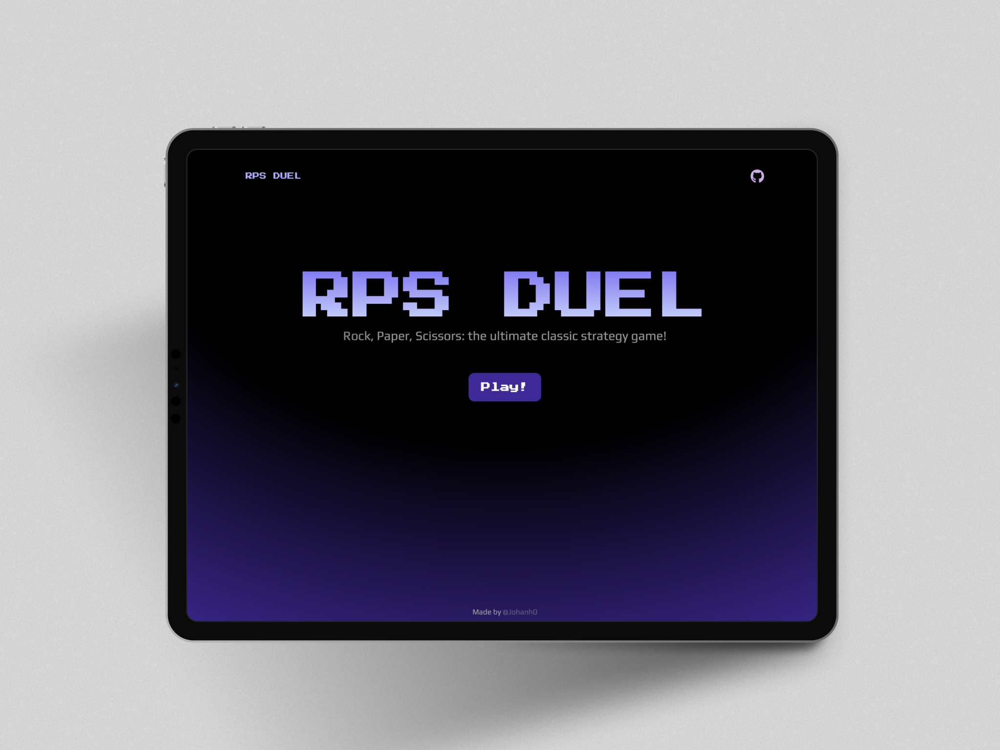
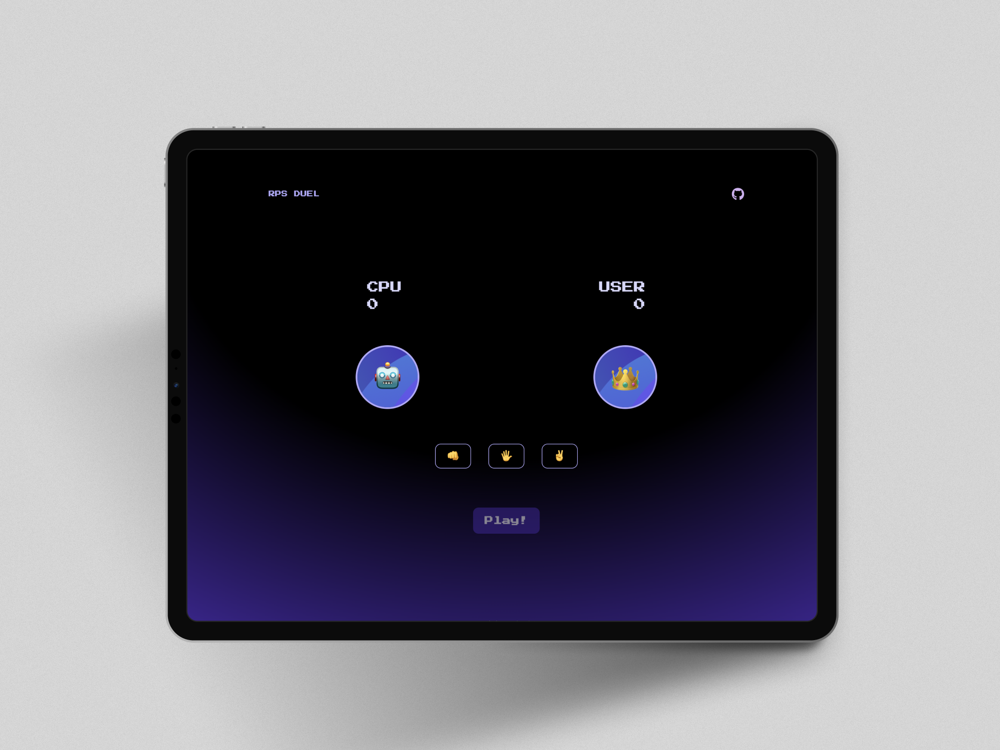

# RPS Game

This project is a simple implementation of the classic Rock, Paper, Scissors game using basic web technologies: HTML, CSS, and JavaScript. Players can compete against the computer in an interactive and engaging way.

&nbsp;

## 🛠 Technologies

- HTML
- CSS
- JavaScript

&nbsp;

## 📖 CDN Libraries

- GSAP JS
- Google Fonts

&nbsp;

## 🚀 Deployment

To deploy this project, [click here.]()

&nbsp;

## 📸 Screen Shots

&nbsp;

## Author

- [@Johanh0](https://www.github.com/johanh0)

## Support or contact

For support or if you wish to contact me, please email me at [johanherrera20000@gmail.com](mailto:johanherrera20000@gmail.com).

You can also contact me via [LinkedIn](https://www.linkedin.com/in/johanh0/).
